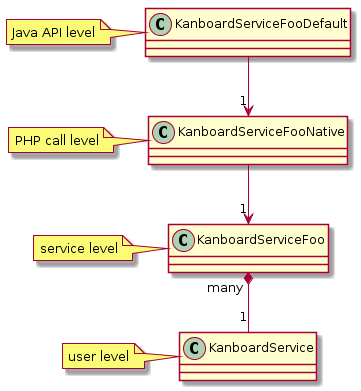

# Project



Following [YAGNI](https://en.wikipedia.org/wiki/You_aren%27t_gonna_need_it) only Kanboard methods deemed necessary are implemented. A complete list of covered methods can be found [here](https://github.com/phoen1x/kanboard-api-java/blob/master/project/src/main/java/de/livingfire/kanboard/constants/KanboardConstant.java). Just start a [pull-request](https://github.com/phoen1x/kanboard-api-java) or open a [issue](https://github.com/phoen1x/kanboard-api-java/issues) if you need more.

## Quick start

[⬆](#)

Make sure you have a working [Docker](https://docs.docker.com/engine/installation/) and
[docker-compose](https://docs.docker.com/compose/install/) environment.

```bash
# download
git clone https://github.com/phoen1x/kanboard-api-java.git
cd kanboard-api-java

# start project
docker-compose up -d

# run integration tests
docker-compose exec maven ./mvnw -Dtest=Kanboard\*\*IntegrationTest test

# build jar file to project/target/kanboard-api-java.jar
docker-compose exec maven ./mvnw clean package

# remove root file permissions
docker-compose exec maven chown -R 1000:1000 /root/.m2 /project

# show build results in web browser - login admin:admin
google-chrome --incognito http://172.19.1.1

# stop project
docker-compose down
```

## Build without Docker

[⬆](#)

```bash
# download
git clone https://github.com/phoen1x/kanboard-api-java.git

# build .jar file without integration tests
cd kanboard-api-java/project
./mvnw clean package
```

## Structure

[⬆](#)



## Usage

[⬆](#)

See [KanboardSetupIntegrationTest](https://github.com/phoen1x/kanboard-api-java/tree/master/project/src/test/java/de/livingfire/kanboard/KanboardSetupIntegrationTest.java) on how to use this YAML file to setup your Kanban board.

```json

```

## Development

### Debug Requests

Set `SHOW_HTTP_REQUESTS = true` in [KanboardConstant.java](https://github.com/phoen1x/kanboard-api-java/blob/master/project/src/main/java/de/livingfire/kanboard/constants/KanboardConstant.java)

```bash
# start debug
find . -name 'KanboardConstant.java' \
    -exec sed -i 's/SHOW_HTTP_REQUESTS = false/SHOW_HTTP_REQUESTS = true/' {} ";"

# end debug
find . -name 'KanboardConstant.java' \
    -exec sed -i 's/SHOW_HTTP_REQUESTS = true/SHOW_HTTP_REQUESTS = false/' {} ";"
```

## Author

[⬆](#)

* [Thomas](http://www.livingfire.de) on [GitHub](https://github.com/phoen1x)

The documentation is written in [Markdown](http://en.wikipedia.org/wiki/Markdown).
If you want to improve the documentation send a [pull-request](https://github.com/phoen1x/kanboard-api-java).
